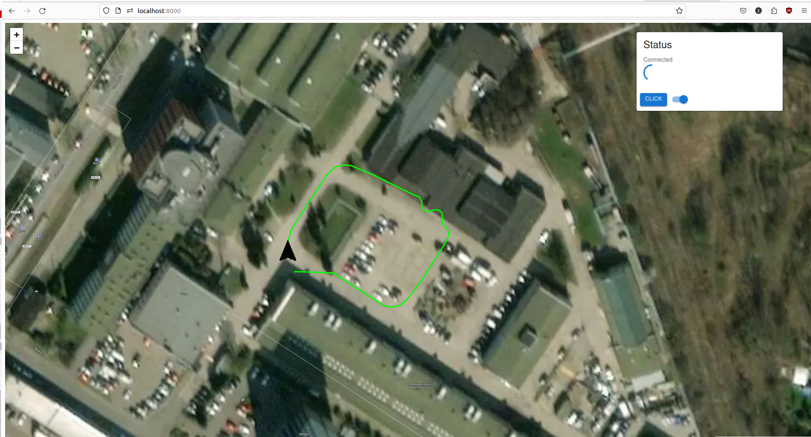

## Description

## Branches description
### master 
Zenoh config from environment variable and client mode 
```
session = zenoh.open({"mode":"client","connect":{"endpoints": [os.environ["ZENOH_URL"]]}})
```
### dev 
Zenoh local config and peer mode

```
session = zenoh.open({})
```
## Installation

```
$ pip install pycdr==0.1.5

$ pip install eclipse-zenoh

$ python -m pip install Django

$ sudo apt install [zenoh-bridge-dds](https://github.com/eclipse-zenoh/zenoh-plugin-dds?tab=readme-ov-file#linux-debian)
```
## Running the application
Open a new terminal
```
$ source /opt/ros/<ros_distro>
$ ros2 bag play <bag file> --loop
```
Open a new terminal
```
$ zenoh-bridge-dds -m peer
```
```
$ zenoh-bridge-dds -m client -e tcp/ip:port
```
Open a new terminal
```
$ cd agrorob_server
$ python manage.py runserver 
```
## Expected result
