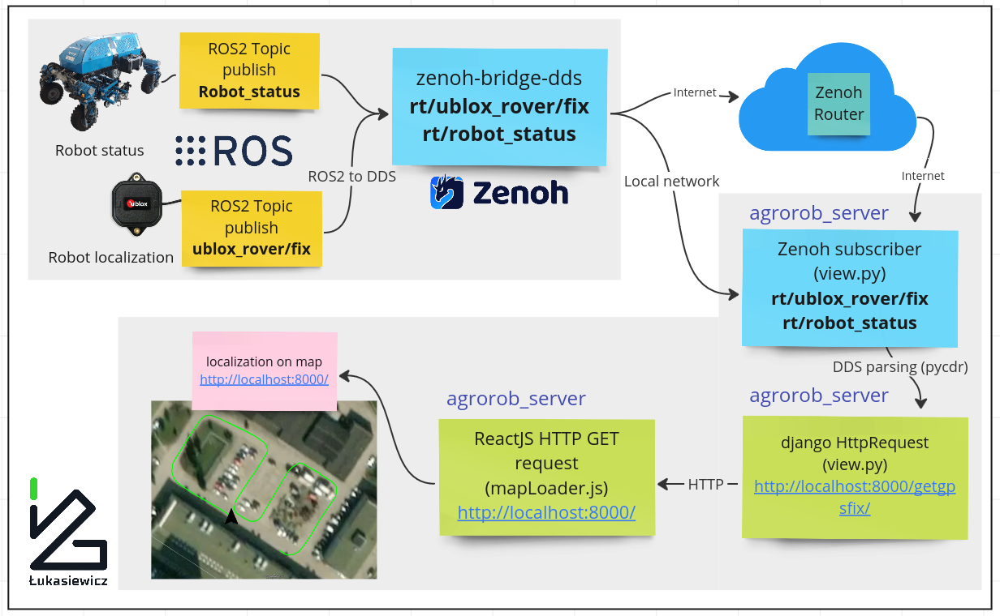
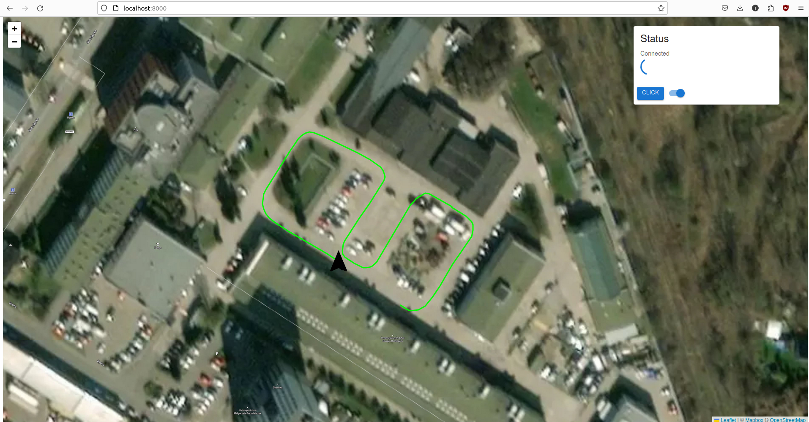

## Description

## Installation

```
$ pip install pycdr==0.1.5

$ pip install eclipse-zenoh

$ python -m pip install Django

$ sudo apt install zenoh-bridge-dds
```
## Running the application
Open a new terminal
```
$ source /opt/ros/<ros_distro>
$ ros2 bag play <bag file> --loop
```
Open a new terminal
```
$ zenoh-bridge-dds -m peer
```
```
$ zenoh-bridge-dds -m client -e tcp/ip:port
```
Open a new terminal
```
$ cd agrorob_server
$ python manage.py runserver 
```
## Expected result
